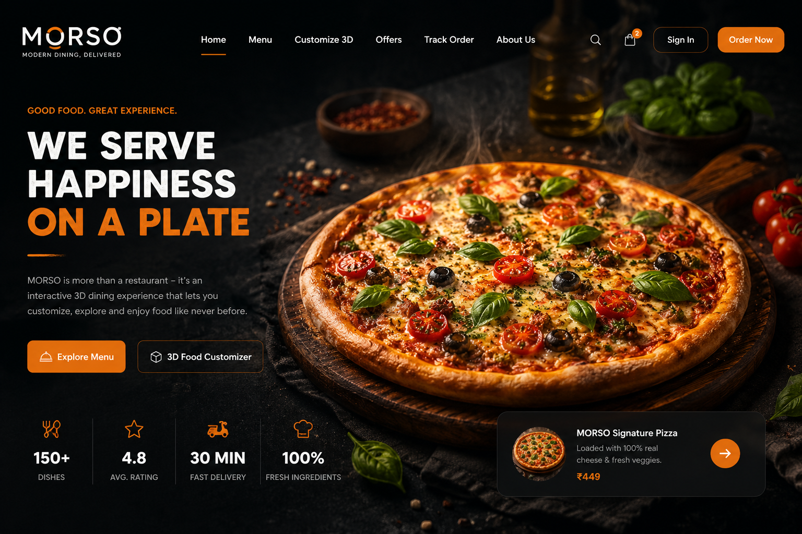
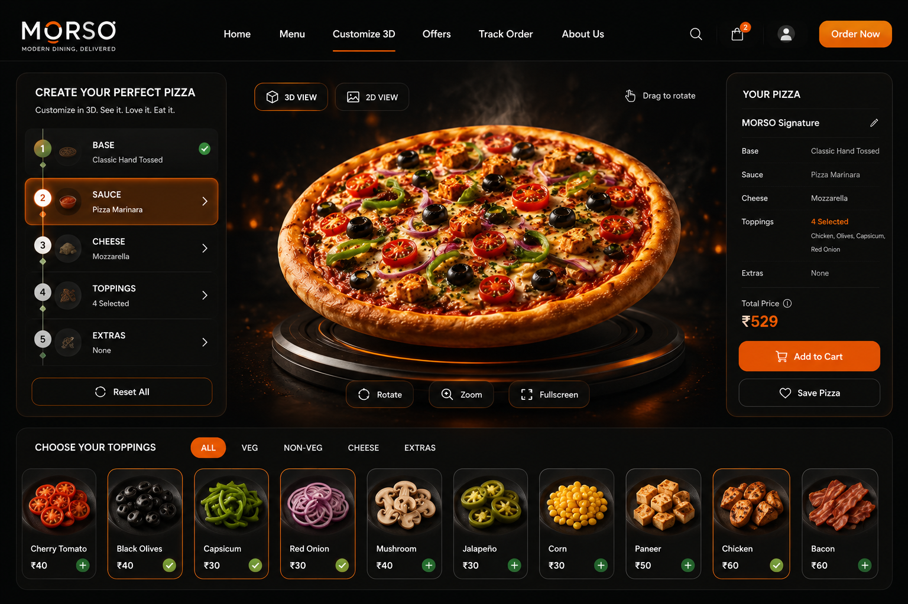
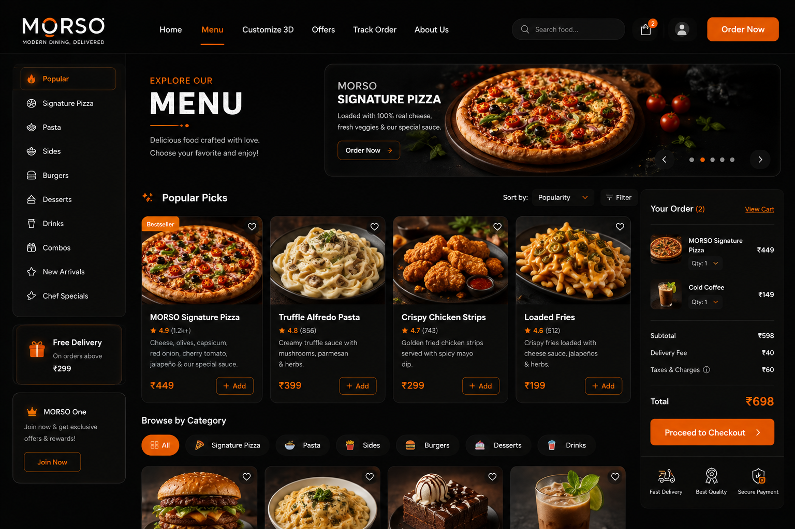
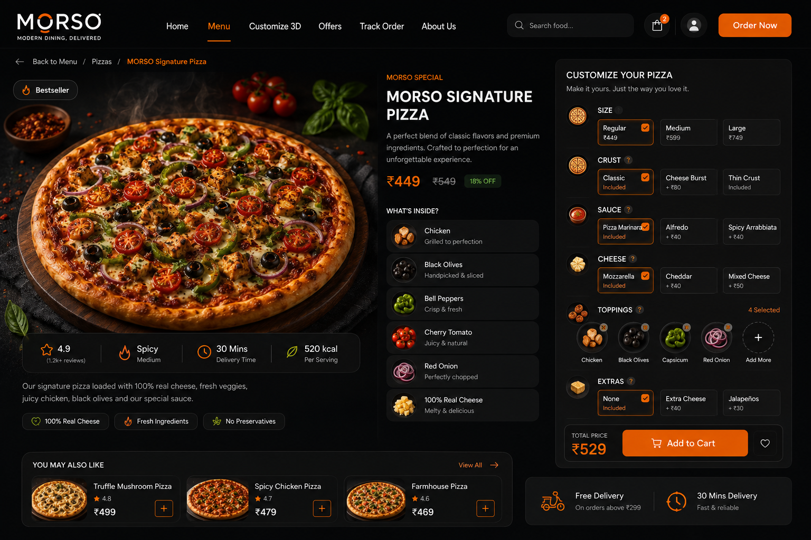
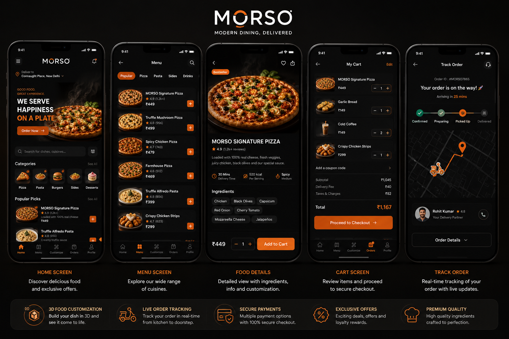
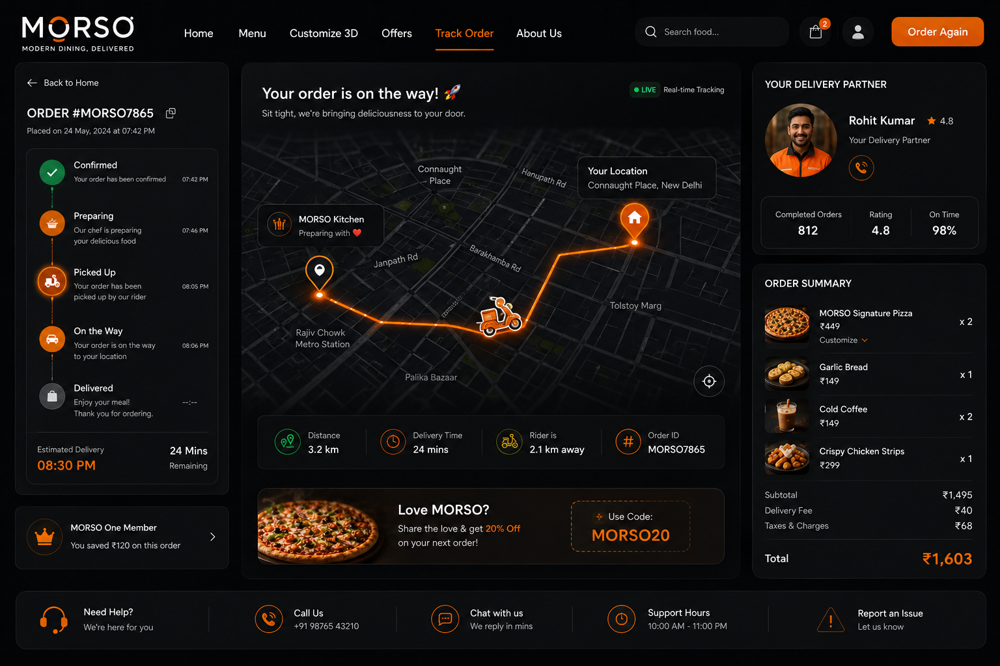
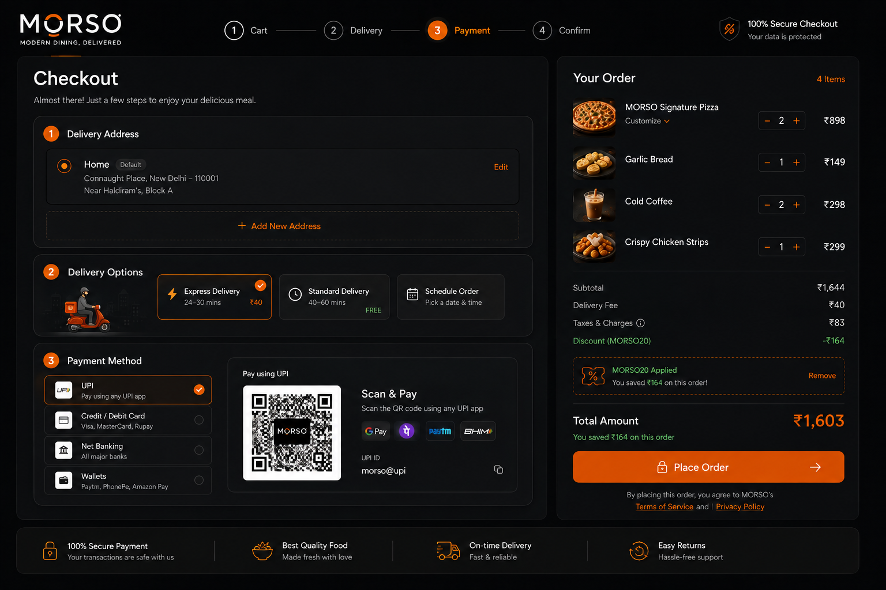
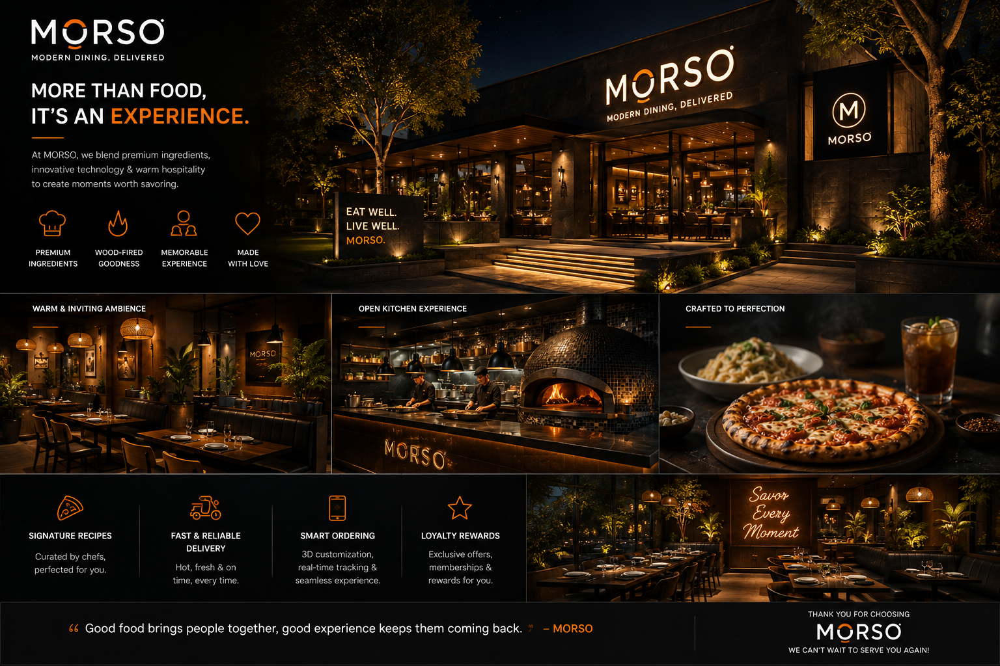

# MORSO — Interactive 3D Restaurant Experience

> **MORSO** is a premium, interactive restaurant ordering concept that combines modern food discovery, 3D customization, playful motion, and a complete digital ordering journey.



## About MORSO

MORSO is an experimental restaurant technology concept created around one simple idea:

**Make online food ordering feel more visual, interactive, and enjoyable.**

Traditional food-ordering interfaces usually depend on static images, text descriptions, and an **Add to Cart** button. MORSO explores a different approach by introducing an interactive 3D food customization experience.

Users can discover dishes, open a food item, customize ingredients, preview their choices, review the price, add the item to their cart, complete checkout, and follow a simulated delivery journey.

MORSO is a **concept/prototype project** for exploring modern frontend engineering, 3D web experiences, interaction design, animation, and restaurant UX.

## Project Vision

MORSO is not intended to be just another restaurant website.

The goal is to create a digital dining experience that connects:

**Food + Design + Interaction + 3D + Motion**

```text
Discover
   ↓
Explore
   ↓
Choose a Dish
   ↓
Customize
   ↓
Preview in 3D
   ↓
Add to Cart
   ↓
Checkout
   ↓
Track Order
```

## Key Features

- Premium restaurant landing page
- Interactive food discovery
- Category-based menu
- Search and filtering
- Food detail pages
- Interactive 3D food customizer
- Ingredient selection
- Dynamic pricing
- Functional cart
- Quantity management
- Coupon handling
- Checkout flow
- Simulated payment selection
- Order confirmation
- Delivery tracking experience
- Responsive mobile interface
- Framer Motion animations
- Three.js / WebGL 3D experience
- Playful micro-interactions
- Reusable React components

# 01 — Hero Experience


The MORSO homepage introduces the brand through a cinematic restaurant experience.

The hero combines premium food imagery with a dark interface and warm orange accents.

### Main elements

- MORSO branding
- Restaurant introduction
- Featured food
- Primary ordering CTA
- Menu discovery
- 3D customization entry point
- Delivery information
- Product highlights

# 02 — 3D Food Customizer



The 3D customizer is the main interactive feature of MORSO.

Instead of showing only a static image, the product can be explored through a browser-based 3D experience.

### Customization flow

```text
Base
 ↓
Sauce
 ↓
Cheese
 ↓
Toppings
 ↓
Extras
```

### Example options

**Base**
- Classic Hand Tossed
- Thin Crust
- Whole Wheat

**Sauce**
- Pizza Marinara
- Alfredo
- Spicy Arrabbiata

**Cheese**
- Mozzarella
- Cheddar
- Mixed Cheese

**Toppings**
- Chicken
- Black Olives
- Capsicum
- Red Onion
- Cherry Tomato
- Mushroom
- Jalapeño
- Corn

**Extras**
- Extra Cheese
- Jalapeño
- Garlic Dip

### 3D interactions

- Rotate
- Zoom
- Reset view
- Optional auto-rotation
- Ingredient selection
- Visual selection feedback

The purpose of 3D is to make food customization easier to understand, not simply to add decoration.

# 03 — Digital Menu



The MORSO menu is designed around quick food discovery.

### Categories

- Popular
- Signature Pizza
- Pasta
- Sides
- Burgers
- Desserts
- Drinks
- Combos
- Chef Specials

### Product cards

Each product can contain:

- Food image
- Dish name
- Description
- Rating
- Price
- Favorite action
- Add to cart action

The menu also supports filtering and search so users can quickly find something they want.

# 04 — Food Detail & Customization



The food detail experience gives users more information before they order.

A product page can include:

- Large food visual
- Product name
- Rating
- Price
- Calories
- Ingredients
- Description
- Delivery estimate
- Customization options
- Add to cart
- Customize in 3D

For example:

## MORSO Signature Pizza

A signature pizza concept with a rich combination of cheese, vegetables, herbs, and optional toppings.

Users can move from the product detail page directly into the 3D customization experience.

```text
Menu
 ↓
Product Detail
 ↓
3D Customization
 ↓
Cart
```

# 05 — Mobile Experience



MORSO is designed to work across desktop, tablet, and mobile devices.

### Mobile screens

- Home
- Menu
- Food Details
- Cart
- Order Tracking

The mobile UI uses large touch targets, compact navigation, horizontal category scrolling, responsive food cards, simplified checkout, and mobile-friendly 3D viewing.

The mobile interface is intentionally designed rather than simply being a scaled-down desktop layout.

# 06 — Order Tracking



The ordering experience continues after checkout.

### Order status

```text
Confirmed
   ↓
Preparing
   ↓
Picked Up
   ↓
On the Way
   ↓
Delivered
```

The tracking interface can display:

- Order ID
- Current status
- Estimated delivery time
- Delivery partner information
- Order summary
- Route visualization
- Support options

For the prototype, tracking is simulated. It does not represent real GPS data or a live delivery network.

# 07 — Checkout Experience



The checkout experience brings the final ordering steps together.

### Checkout stages

```text
Cart
 ↓
Delivery
 ↓
Payment
 ↓
Confirmation
```

### Delivery

- Saved address
- Add address
- Delivery option

### Payment

- UPI
- Credit/Debit Card
- Net Banking
- Wallet

Payment is simulated for demonstration and does not process real financial transactions.

### Order summary

- Items
- Quantity
- Subtotal
- Delivery fee
- Taxes
- Discount
- Final amount

The final total should be calculated from cart state rather than hard-coded.

# 08 — Restaurant Experience



MORSO is designed as a complete restaurant brand experience, not just an ordering interface.

The physical restaurant concept uses:

- Warm lighting
- Premium materials
- Contemporary furniture
- Open kitchen elements
- Food-focused presentation
- Consistent MORSO branding

### Brand idea

**MORE THAN FOOD, IT'S AN EXPERIENCE.**

The digital product and physical restaurant are treated as parts of the same brand ecosystem.

# User Experience

The complete MORSO journey is designed around reducing friction while increasing visual engagement.

**Discovery** — Quickly browse categories and featured dishes.

**Decision** — Food details provide useful information before ordering.

**Customization** — The 3D customizer gives users control over ingredients.

**Purchase** — Cart and checkout keep selections and pricing visible.

**Post-order** — Tracking provides a clear view of the order journey.

# Design System

MORSO uses a dark, premium interface with warm food-inspired accents.

### Visual direction

- Charcoal
- Near-black
- White
- Soft gray
- Warm orange
- Natural food tones

Orange is mainly used for CTA buttons, active states, selected options, price highlights, and progress indicators.

### Core components

- Navigation
- Buttons
- Product cards
- Category chips
- Price displays
- Cart panels
- Checkout cards
- Status indicators
- Modal panels
- Form controls

# Motion Design

Motion is an important part of the MORSO experience.

Framer Motion can be used for:

- Page transitions
- Section reveals
- Card animations
- Button interactions
- Cart updates
- Price transitions
- Modal animations
- Navigation transitions
- Scroll-based reveals

The motion system should remain subtle and responsive.

# 3D Technology

The MORSO 3D experience is designed around:

- Three.js
- React Three Fiber
- Drei
- WebGL

```text
Pizza Scene
├── Base
├── Crust
├── Sauce
├── Cheese
├── Toppings
├── Lighting
├── Camera
└── Controls
```

A production implementation can use optimized GLTF/GLB models where appropriate.

# Technology Stack

| Technology | Purpose |
|---|---|
| React | Application interface |
| TypeScript | Type-safe development |
| Vite | Development and build tooling |
| Three.js | 3D rendering |
| React Three Fiber | React-based Three.js integration |
| Drei | 3D helpers |
| WebGL | Browser-based graphics |
| Framer Motion | Animation and interaction |
| Tailwind CSS | Responsive styling |

# Suggested Project Structure

```text
MORSO/
├── public/
│   ├── models/
│   └── textures/
│
├── src/
│   ├── components/
│   │   ├── layout/
│   │   ├── navigation/
│   │   ├── hero/
│   │   ├── menu/
│   │   ├── product/
│   │   ├── cart/
│   │   ├── checkout/
│   │   ├── tracking/
│   │   ├── restaurant/
│   │   ├── ui/
│   │   └── 3d/
│   │
│   ├── pages/
│   ├── data/
│   ├── context/
│   ├── hooks/
│   ├── lib/
│   └── App.tsx
│
├── assets/
│   └── images/
│       ├── morso-hero.png
│       ├── morso-3d-customizer.png
│       ├── morso-menu.png
│       ├── morso-food-detail.png
│       ├── morso-mobile.png
│       ├── morso-tracking.png
│       ├── morso-checkout.png
│       └── morso-restaurant.png
│
├── index.html
├── package.json
├── tsconfig.json
├── vite.config.ts
└── README.md
```

# Application Routes

| Route | Purpose |
|---|---|
| `/` | MORSO homepage |
| `/menu` | Food menu |
| `/menu/:id` | Product details |
| `/customize/:id` | 3D customization |
| `/cart` | Shopping cart |
| `/checkout` | Checkout |
| `/track-order` | Order tracking |
| `/about` | Restaurant and brand |

# State Management

Important shared state includes:

### Cart State

- Products
- Quantity
- Customization
- Subtotal
- Discount
- Delivery fee
- Final total

### Customization State

- Base
- Sauce
- Cheese
- Toppings
- Extras

### Order State

- Order ID
- Current status
- Delivery estimate
- Selected items

# Pricing Logic

```text
Base Price
+ Sauce Upgrade
+ Cheese Upgrade
+ Toppings
+ Extras
----------------
Final Item Price
```

Cart totals:

```text
Item Total
+ Delivery Fee
+ Taxes
- Discount
----------------
Final Order Total
```

# Responsive Design

MORSO should support:

```text
320px
375px
390px
430px
768px
1024px
1280px
1440px
1920px
```

Test navigation, food cards, 3D viewer, checkout, cart, tracking, typography, touch controls, and overflow at these sizes.

# Accessibility

The product should follow basic accessibility practices:

- Semantic HTML
- Keyboard navigation
- Accessible buttons
- Visible focus states
- Meaningful alt text
- Good contrast
- Proper labels
- Reduced-motion support
- Touch-friendly controls

Important interactions should never depend only on hover.

# Performance

Recommended practices:

- Optimized 3D models
- Reasonable texture sizes
- Lazy loading for heavy 3D assets
- Controlled animation loops
- Efficient React rendering
- Proper Three.js resource disposal
- WebGL fallback
- Suspense for asynchronous 3D assets

# Error & Empty States

### Empty cart

```text
Your cart is empty.

Let's find something delicious.
```

### Invalid product

```text
We couldn't find that dish.

Explore the MORSO menu.
```

### WebGL unavailable

```text
3D preview isn't available on this device.

You can still customize your meal using the standard interface.
```

Checkout should validate required delivery and payment information before an order can be placed.

# Security & Data Notes

MORSO is a frontend concept/prototype.

It should not collect or store real card information, banking credentials, sensitive customer information, or real GPS information.

Payment and delivery functionality shown in the prototype should remain simulated unless a secure production backend is intentionally implemented.

# Future Improvements

- Real authentication
- Restaurant admin dashboard
- Kitchen order management
- Inventory management
- Real payment gateway
- Real order APIs
- Delivery partner application
- Real-time order updates
- User profiles
- Order history
- Favorites
- Loyalty program
- Personalized recommendations
- Multiple restaurant locations
- AR food previews
- Advanced 3D customization
- Backend-driven menu management

# Project Status

**Status: Concept / Prototype**

MORSO is an experimental project focused on restaurant UX, 3D web interaction, product customization, motion design, responsive frontend development, and digital product presentation.

It is not presented as a live restaurant service.

# Visual Gallery

## MORSO Hero


## 3D Food Customizer


## Digital Menu


## Food Detail


## Mobile Experience


## Order Tracking


## Checkout


## Restaurant Experience


# Getting Started

## Prerequisites

- Node.js
- npm

## Installation

```bash
git clone <your-repository-url>
cd MORSO
npm install
```

## Development

```bash
npm run dev
```

## Production Build

```bash
npm run build
```

# Development Principles

### 1. Interaction should have a purpose

Animations and 3D should improve the experience rather than exist only for visual effect.

### 2. Keep ordering simple

The user should always understand what they selected and how much it costs.

### 3. Make customization visual

The 3D customizer is the main differentiating feature.

### 4. Keep the interface consistent

The same visual language should continue from homepage to checkout.

### 5. Design for real devices

Desktop, tablet, and mobile should all receive an intentional experience.

# Disclaimer

MORSO is a fictional restaurant concept/prototype created for design and engineering exploration.

Names, menu items, prices, ratings, order IDs, delivery information, restaurant visuals, customer information, and other values shown in the prototype are illustrative.

They do not represent verified commercial operations, real customers, real orders, real delivery statistics, or real business performance.

# License

This project is intended as a portfolio/concept project.

If this repository is made public, define the license according to how you want the source code and assets to be reused.

---

# MORSO

**MODERN DINING, DELIVERED.**

Food discovery meets interactive 3D, thoughtful UX, and modern web technology.

**Discover. Customize. Order. Enjoy.**
